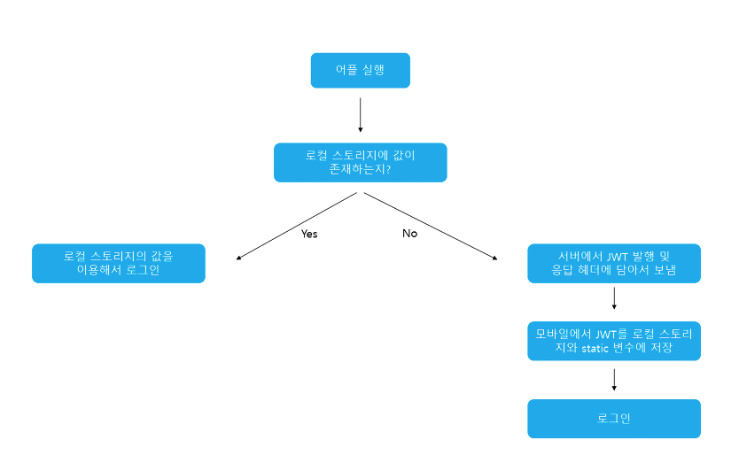

```
질문
1. JWT 를 설명하세요
2. 일반 토큰 기반과 Claim 토큰 기반의 차이는 무엇인가요?
3. JWT의 장점을 설명하세요
4. JWT의 단점을 설명하세요.
5. Access Token의 문제점을 설명하고 이를 해결할 방법을 말해보세요
    → Refresh Token
6. JWT의 구조를 설명하세요.
```

# JWT(Json Web Token)

클라이언트와 서버 사이에서 통신할 때 권한을 위해 사용하는 토큰.

Json 포맷을 이용하여 사용자에 대한 속성을 저장하는 `Claim 기반`의 Web Token.

토큰 자체를 정보로 사용하는 Self-Contained(자가 수용적) 방식으로 정보를 안전하게 전달한다.

아래의 로직을 따라서 처리된다.



애플리케이션이 실행될 때 JWT를 static변수와 로컬스토리지에 저장하게 된다.

static변수에 저장되는 이유는 HTTP 통신을 할 때마다 JWT를 HTTP 헤더에 담아서 보내야 하는데, 이때마다 계속 로컬 스토리지에서 불러오면 오버헤드가 발생하기 때문이다.

---

## JWT의 구조


Header, Payload, Signature의 3 부분으로 이루어지며, 각 부분은 Base64Url로 인코딩 되어 표현된다.
또한 각각의 부분을 이어 주기 위해 `.` 구분자를 사용한다.

Base64Url은 암호화된 문자열은 아니고, 같은 문자열에 대해 항상 같은 인코딩 문자열을 반환한다.

### Header

헤더에는 typ과 alg 두 가지 정보로 구성된다.

- alg : Signature를 해싱하기 위한 알고리즘을 지정, 서명 및 토큰 검증에 사용. 보통 HMAC-SHA256 혹은 RSA가 사용된다.
- typ : 토큰의 타입을 지정

```json
{
	"typ": "JWT",
	"alg": "HS256"
}
```

### Payload

토큰에서 사용할 정보의 조각들인 클레임(Claim)이 담겨 있다.

클레임은 총 3가지로 나누어지며, Json 형태로 다수의 정보를 넣을 수 있다.

1. 등록된 클레임(Registered Claim)

   토큰 정보를 표현하기 위해 이미 정해진 종류의 데이터들

   선택적으로 작성이 가능하며 사용할 것을 권장한다.

   - iss : 토큰 발급자(issuer)
   - sub : 토큰 제목(subject)
   - aud : 토큰 대상자(audience)
   - exp : 토큰 만료 시간(expiration), NumericDate 형식
   - nbf : 토큰 활성 날짜(not before), 이 날이 지나기 전의 토큰은 활성화되지 않음
   - iat : 토큰 발급 시간(issued at), 토큰 발급 이후의 경과 시간을 알 수 있음
   - jti : 토큰 식별자(JWT ID), 중복 방지를 위해 사용하며, Access Token 등에 사용

2. 공개 클레임(Public Claim)

   사용자 정의 클레임으로, 공개용 정보를 위해 사용한다.

   충돌 방지를 위해 URI 포맷을 이용한다.

3. 비공개 클레임(Private Claim)

   사용자 정의 클레임으로, 서버와 클라이언트 사이에 임의로 지정한 정보를 저장한다.

### Signature

서명은 토큰을 인코딩하거나 유효성 검증을 할 때 사용하는 고유한 암호화 코드이다.

```
🖋️ 서명 생성
헤더와 페이로드의 값을 각각 Base64Url로 인코딩하고, 인코딩한 값을 비밀 키를 이용해 헤더에서 정의한 알고리즘으로 해싱을 하고, 이 값을 다시 Base64Url로 인코딩하여 생성한다.
```

---

### JWT 위치

생성된 토큰은 HTTP 통신을 할 때 Headers의 Authorization이라는 key의 value로 사용된다.

일반적으로 value 에는 Bearer이 앞에 붙여진다.

```json
{
	"Authorization": "Bearer {생성된 토큰 값}"
}
```

---

### JWT 장점

- 사용자 인증에 필요한 모든 정보를 토큰 자체에 포함하기 때문에 별도의 인증 저장소가 필요 없다.
- 쿠키를 전달하지 않아도 되므로 취약점이 사라진다.
- 트래픽에 대한 부담이 낮다.
- REST 서비스로 제공 가능하다.

### JWT 단점

- 토큰 자체에 정보를 담고 있으므로 양날의 검이 될 수 있다.
- 토큰의 페이로드에 3종류의 클레임을 저장하기 때문에, 정보가 많아질수록 토큰의 길이가 늘어나 네트워크에 부하를 줄 수 있다.
- 페이로드 자체는 암호화 된 것이 아니라, 인코딩 된 것이기 때문에 중간에 탈취하여 디코딩하면 데이터를 볼 수 있다.
- 상태를 저장하지 않기 때문에 한번 만들어지면 제어가 불가능하다. 그러므로 토큰 만료 시간을 꼭 넣어주어야 한다.
- 유효기간을 짧게 하면 재로그인 시도가 잦아지고, 길게 하면 해커에게 탈취될 가능성이 크다.

---

### 일반 토큰 기반 vs Claim 토큰 기반

일반 토큰 기반 인증은 토큰을 검증할 때 필요한 관련 정보들을 서버에 저장해두고 있었기 때문에 항상 DB에 접근해야만 했었다. 또한 session 방식 또한 저장소에 저장해두었던 session ID를 찾아와 검증하는 절차를 가져 다소 번거롭게 느껴지곤 했다.

클레임 토큰 기반 인증은 JWT에 사용자 인증에 필요한 모든 정보를 토큰 자체에 담고 있기 때문에 별도의 인증 저장소가 필요없다. 분산 마이크로 서비스 환경에서 중앙 집중식 인증 서버와 데이터베이스에 의존하지 않는 쉬운 인증을 제공.

---

### Refresh Token

Access Token을 통한 인증 방식의 문제로 탈취당할 경우 보안에 취약하다는 점이 있다.

유효기간을 짧게 하면서 보안을 챙길 수 있도록 하는게 Refresh Token!

Access Token과 똑같은 형태의 JWT. 로그인이 완료되었을 때 Access Token과 동시에 Refresh Token은 긴 유효기간을 갖고 발행되고 Access Token의 유효기간이 만료되었을 때 새로 Token을 발급해주는 열쇠가 된다.
